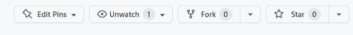
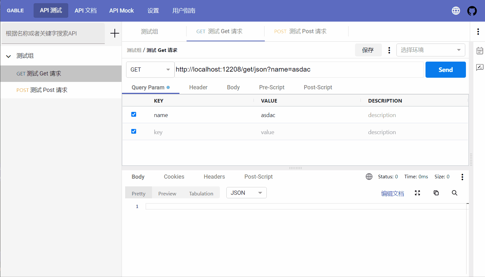
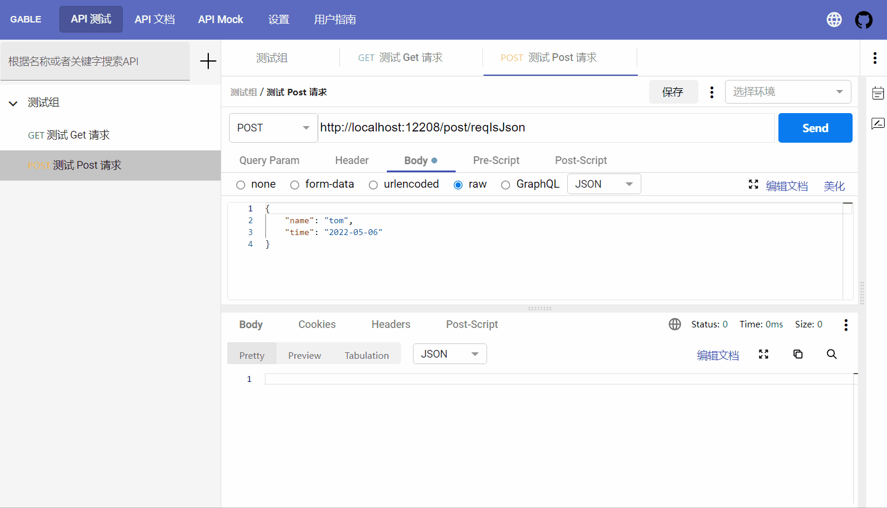
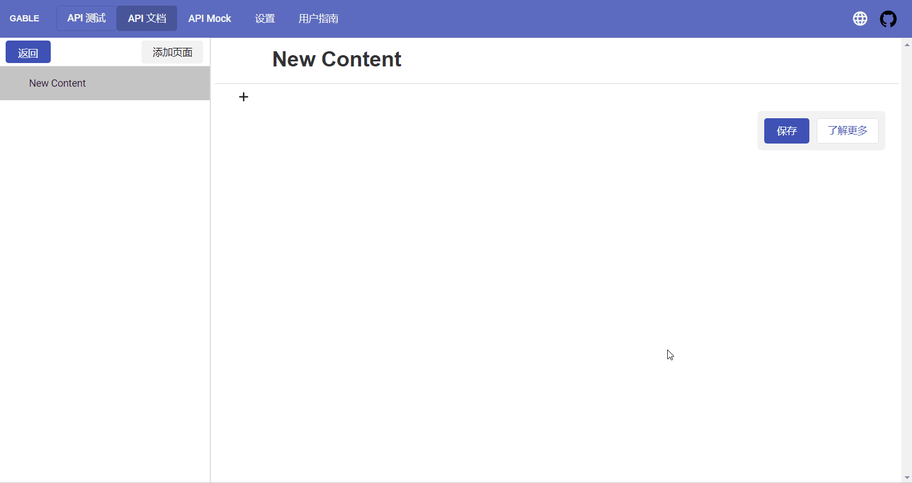

# Gable
[![document][document-image]][document-link]
[![License][license-badge]](LICENSE.md)

[license]: https://github.com/AdvancedProductivity/Gable/blob/main/LICENSE
[license-badge]: https://img.shields.io/badge/license-Apache%202-blue

[document-image]: https://github.com/AdvancedProductivity/Gable/actions/workflows/vuepress-deploy.yml/badge.svg
[document-link]: https://advancedproductivity.github.io/Gable/

`Gable` 是一款开源的，全平台，安全的 API 协作工具。
我们的雄心壮志是做一款全世界最好用的API 协作工具。

## ✨ 特性

- 🐱‍‍ 全开源，无任何功能阉割
- 🎨 全平台，既支持 web 端部署，又支持 `Electron` 客户端，还支持浏览器插件，
- 🌈 安全，数据全部存在用户端，无需担心泄露HTTP接口信息给第三方
- ⚙️ 高效协作，接口文档自动生成，自由编辑，提供更好的协作体验
- 🌍️ 国际化设计，支持中英两种语言
- 📦️ 长久支持，更多功能还在开发中......

# 资源

在线体验: [https://advancedproductivity.github.io/GablePreview/](https://advancedproductivity.github.io/GablePreview/)

（注：该在线体验没有任何功能阉割，和本机部署一样正常提供服务）

文档/用户指南: [https://advancedproductivity.github.io/GablePreview/docs/](https://advancedproductivity.github.io/GablePreview/docs/)

# :star: Support Us and Keep Updated :star:

点个 star 激励一下作者吧 😊😊😊

# 预览

## 运行 Http 请求
就像`Post Man`一样运行 Http 请求。

## 自动生成接口文档
当接口发生变更之后，点击上方的保存按钮，即可保存接口的变更，同时生成一份默认的接口文档，非常便于协作。

## 编写文档时嵌入 Http 接口执行面板

如果自动生成的接口文档不能满足需要，可以自己编写文档，而且可以把 Http Api 的执行面板嵌入到文档中。

# 声明

`Gable` 当前还处于测试阶段，更多的功能和更好的用户体验，都还在紧锣密鼓的研发与优化中，希望用户能给较高的容忍度和成长空间,谢谢大家 
